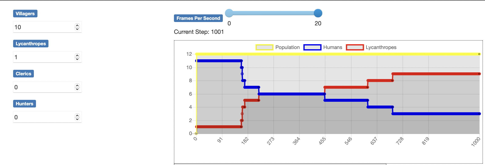

## Question 1
### Stratégie :
- Dans la méthode step, si l'agent est un lycanthrope, alors à chaque tour il cherche à attaquer.
- On regarde la liste des agents à portée de 40 : on stocke les agents dans une liste, on fait bien attention de stocker l'id de ces voisins car il ser utilisé pour les retrouer dans la liste des agents du modèle.
- On en choisi un au hasard si cette liste de voisins à portée est non vide.
- Une fois la cible choisie, on va chercher l'instance de cet agent dans le modèle en utilisant son id unique, puis on modifie l'attribut de cet agent.

C'est compatible avec la notion d'agent, en particulier :
- les agents peuvent interragir entre eux (le lycanthrope agit sur sa victime en modifiant ses attributs).
- les agents peuvent évoluer (attribut interne de l'agent mordu qui devient lycanthrope).
- les agents sont compétitifs (intérêts personnels, mordre les autres pour les lycanthropes).

## Question 2
- Avec de tels paramètres (20 villageois, 5 lycanthropes, 1 apothicaire et 2 chasseurs) le village tend à n'avoir plus que des lycanthropes au bout 700 steps : ils sont trop rapides et gros ! La présence d'apothicaire permet de **ralentir** la vitesse de convergence, voir de stopper la convergence, si il y en a assez.
- Influence des villageois : au début quand le nombre augmente, on mt plus de temps à avoir plus de lycanthropes que du reste. Mais passé un certain stade, comme la taille du village est constante, si il y a beaucoup de villageois, alors les morsures se propagent beaucoup plus vite et alors on a une convergence plus rapide.
- Plus il y a de lycanthropes, plus vite on converge vers l'état où il y a plus de lycanthropes que d'autre chose.
- Plus il y a d'apothicaires, moins on a de chance d'avoir un inversement de la population (plus de lycanthropes que d'autre chose).
- Plus il y a de chasseurs, moins on a de chance d'avoir un inversement de la population (plus de lycanthropes que d'autre chose) et plus la taille de notre population totale diminue.

## Question 3

Les conjectures sont validées par la simulation : diminution de la population totale à cause des chasseurs, au début de la simulation, forte vitesse de contamination des loups-garou (car le village est densément peuplé) puis réduction de cette vitesse er convergence plus lente.

## Question 4
### En faisant varier les paramètres, on vérifie nos conjectures :
#### On voit bien que plus le village est dense, plus vite l'inversion de population opère (fig. High & low density):
 
 

#### On observe un comportement un imprévisible, chaotique quand il y a une certaine proportion d'agent (fig. chaos):

#### Avec suffisamment de chasseurs, on converge vers une population très stable sans lycanthropes (fig. stable):

On peut voir que la dynamique de la population est très complexe à analyser et l'intérêt de la modélisation pour ce genre de problème (on peut notamment aisément penser à des modèles sur la propagation de virus, etc).

## Question 5
### Les paramétres qui ont une influence sur les résultats sont :
- Les nombre de chaque catégorie d'agent (proportion et quantités jouent).
- La vitesse de déplacement des agents (plus la vitesse est rapide, plus on converge vite).
- Le rayon d'action des différents agents (que ce soit en attaque, en chasse ou en guérison).
- L'initialisation joue beaucoup : on peut voir que quand on met un lycanthrope et un villageois très loins initialement, ils vont mettre beaucoup de temps à se rencontrer en moyenne.

## Question 6
### Hypothèse :
- Le nombre de survivants (humains) à la fin de la simulation augmente avec le nombre d'apothicaires et celui des lycanthropes diminue.

## Question 7

Le nombre de survivants (humains) à la fin de la simulation augmente avec le nombre d'apothicaires avec une tendance presque linéaire et celui des lycanthropes diminue (mais de manière plus chaotique).

## Question bonus
### Si l'on souhaite faire varier tous les paramètres, on voit deux problèmes :
- l'explosion combinatoire qui va faire qu'il y a trop de calculs à faire et cela prendra trop de temps. Une solution est d'utiliser le batch runner multiprocessing. La solution est la nouvelle fonction `run_batch_mp`.
- Le deuxième problème est la visualisation du résultat. En faisant varier un seul paramètre, on peut facilement afficher un graphe en 2D, mais avec plus de paramètres, il faut trouver d'autres visualisations. Peut-être faut-il chercher uné métrique à optimiser (par exemple le nombre de survivants à la fin de la simulation ?).

