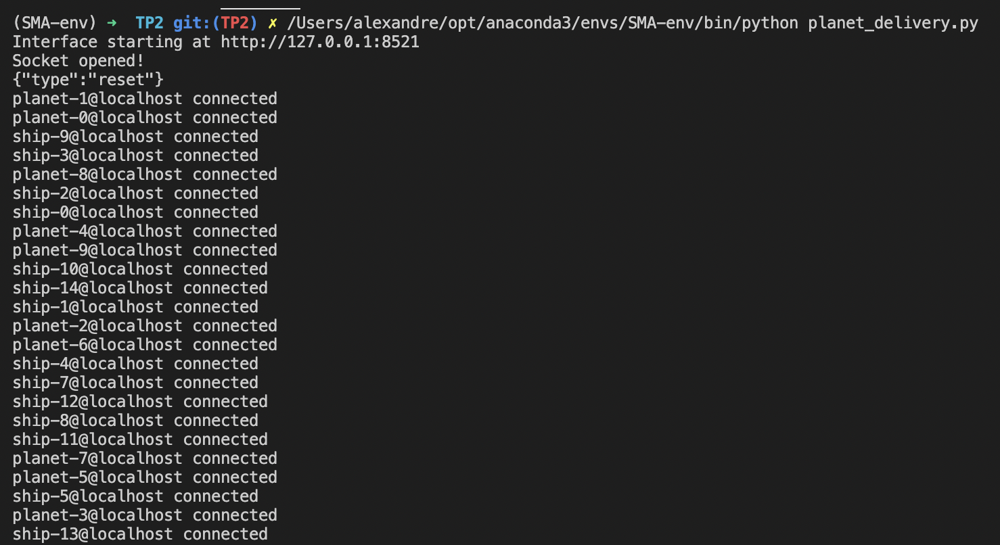

1. `brew tap prosody/prosody`
2. `arch -arm64 brew install prosody`
3. Créer un user localhost en command line : `prosodyctl cred generate localhost` et prendre soin de noter où sont stockés les credentials, pour moi : `"/opt/homebrew/var/lib/prosody/localhost.key"`. Attention à bien créer l'user localhost et pas avec un nom choisi ca le TP fonctionne avec localhost uniquement, mieux vaut éviter tout bug induit par un choix de nom personnalisé.
4. S'assurer qu'un dossier localhost existe bien à cette adresse : `/opt/homebrew/var/lib/prosody/localhost`. Sinon le créer à la main avec `mkdir /opt/homebrew/var/lib/prosody/localhost` (moi j'ai du le supprimer puis le recréer car il n'avait pas les droits d'écriture et ainsi prosody envoyait l'erreur : "error Unable to write to accounts storage").
5. Modifier le fichier de config à l'adresse : "/opt/homebrew/etc/prosody/prosody.cfg.lua" :
   1. Ligne 89 : mettre à jour le ssl avec les véritables adresses des creds (pour moi) : `ssl = {key = "/opt/homebrew/var/lib/prosody/localhost.key";certificate = "/opt/homebrew/var/lib/prosody/localhost.crt";}` 
   2. Ligne 149 : Ajouter `prosody_user="localhost"` 
   3. Créer un fichier pid en faisant en command line : `touch /opt/homebrew/var/lib/prosody/prosody.pid`
   4. Ligne 150 : Ajouter `pidfile="prosody.pid"`
6. Tester que prosody fonctionne bien avec `prosodyctl start`: s'il affiche "Prosody is already running with PID ..." alors c'est gagné.
7. Modifier le script sh par : `prosodyctl start;for i in {0..50};do prosodyctl register ship-$i localhost password-ship-$i;done;for i in {0..50};do prosodyctl register planet-$i localhost password-planet-$i;done`. En gros on a enlevé tous les sudo et bien vérifié que l'on store sur le bon user : localhost. 
8. Lancer le script 
9. Vérifier que ça marche (aucun message d'erreur ne doit être émis). 