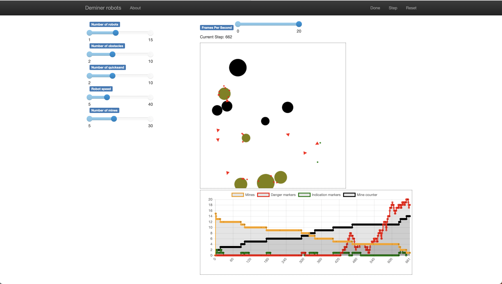
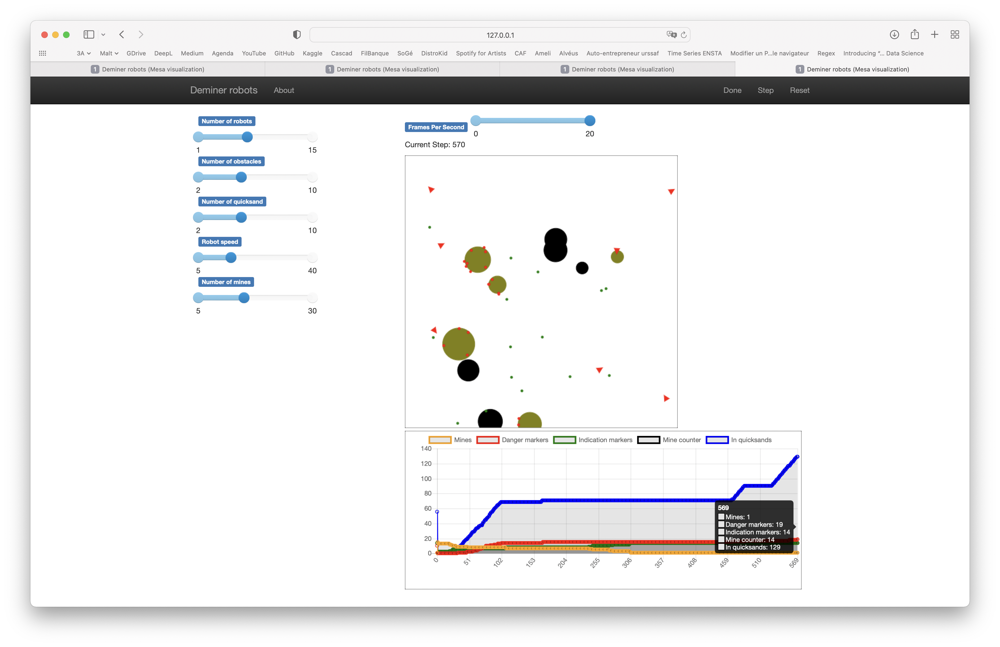

# TP3 - Déminage

Authors:
- Grégoire Hugon
- Alexandre Bodinier

### Q1

Les agents, tels que décrits dans l'énoncé sont des agents réactifs : ils percoivent un certain nombre d'éléments de son environnement et adapte son comportement avec des règles simples à base de règles. L'architecture *Mars Explorer* de Luc Steels vue dans le cours semble toute indiquée, c'est une *architecture par niveau*.

### Q2

Dans une architecture par niveau, le comportement le plus bas est celui ayant la priorité la plus haute, ainsi, on va classer les règles par ordre décroissant de priorité

- Niveau 0 : Eviter les collisions (entre agent, obstacles et bordures)

- Niveau 1 : Rechercher et détruire les mines

- Niveau 2 : Explorer

Voici un apperçu d'une simulation

 

Le temps moyen passé à désamorçer 15 mines pour avec 7 robots avec une vitesse de 15 est de 1200 cycles.
Ce temps moyen évolue rapidement avec la vitesse (pour une vitesse de 25, on met en moyenne 300 cycles).

### Q3

Nos agents sont :

* Simples (uniquement des règles simples, comme l'évitement par exemple). Perception entraîne action.
* Pas de modèle, on ne fait aucune prédiction, on reçoit juste les données brutes de l'environnement (majoritairement des informations de position et de nature d'objets).

En revanche, le principe de *modularité* est questionnable puique certaines actions sont composites (comme le fait de chercher une mine par exemple qui est composé d'une succession d'actions simples (observer, trouver la plus proche, se déplacer, mettre à jour les variables d'état)).

### Q4

Avec le dépôt des balises, on autorise un comportement supplémentaire : la *communication indirecte* qui permet l'émergence de complexité.

### Q5

Voici la nouvelle architecture :

- Niveau 0 : Eviter les collisions (entre agent, obstacles et bordures)

- Niveau 1 : Rechercher et détruire les mines

- Niveau 2 : Prise d'information (chercher et ramasser des balises, agir en conséquence avec des changements de direction)

- Niveau 3 : Explorer

### Q6

Avec ces nouveaux comportements, le temps moyen de désamorçage des 15 mines par les 7 robots avançant à une vitesse de 15 est de : 700 cycles.

On observe que le temps de désamorçage à diminué, pour deux raisons (hypothèses) :
- Moins de temps passé dans les sables mouvants
- Abandon de la recherche dans un espace où une mine a déjà été trouvée (et donc si il y en a d'autres, alors le robot qui a trouvé la première a sûrement trouvé les autres également).

En revanche, on voit l'émergence de comportements pas forcément souhaités : parfois une balise indication empêche un robot de découvrir une mine. Parfois le fait d'aller chercher les balises de danger ont pour effet de rapprocher le robot du sable mouvant. Certains robots perdent du temps à ramasser les balises plutôt que d'explorer les zones encore inconnues. La *communication est imparfaite*.

### Q7

Sur 500 cycles, avec 7 robots, **600 cycles** sont passés dans les sables mouvants. Avec les balises de danger, ce nombre passe à seulement **500 cycles**.

Les robots arrivent à mieux éviter les sables mouvants grâce à la communication. Mais il reste tout de même des problèmes.

Notons que cette évaluation est imparfaite : il y a une grosse variabilité du temps passé dans des sables mouvants : cela dépend de leur disposition (par exemple un quicksand sur le bord est un véritable "trou noir", les robots arrivent encore moins à un sortir). Il faudrait évaluer l'apport de la communication sur des environnements identiques et non aléatoires, il faudrait faire également un grand nombre d'expériences afin d'avoir un estimateur de la moyenne plus fin.