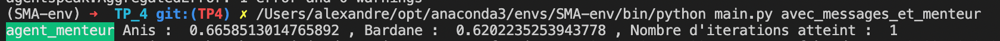

# TP4 - Les apothicaires

### Question 1
Contrairement à l'architecture PRS vue en cours, les croyances des agents peuvent être modifiées par les informations reçues d'autres agents en plus des informations collectées par l'observation de l'environnement et du raisonneur.
Les informations sont envoyées d'un agent à l'autre via de la communication (nous verrons plus tard que ceci permet de modéliser également des comortements néfastes (menteurs, ...)).

### Question 2

Nous allons tester avec et sans partage d'information (messages).

- Sans partage d'information :

    

- Avec partage d'information :

    

On remarque qu'avec messages, les récoltes sont plus homogènes entre agents et le nombre d'itérations diminue.

Encore une fois, l'aspect aléatoire oblige à faire des moyennes sur un certain nombre d'itérations afin de réduire les effets stochastiques.

### Question 3

On introduit un agent "menteur" :

Pour l'agent menteur :

Pour les autres agents :

L'agent menteur ne récolte que très peu de ressources tandis que les autres en ont plus pour eux donc ils en récoltent plus (mais mettent plus de temps).
